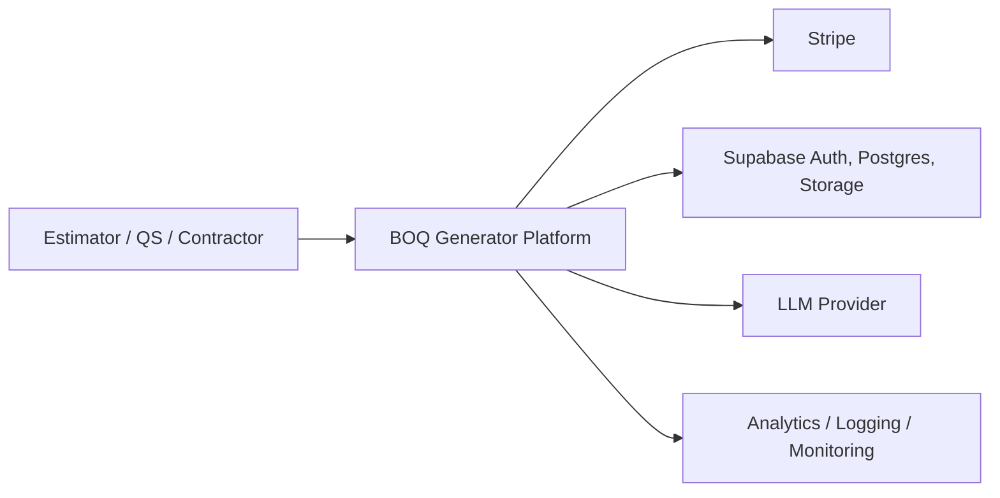
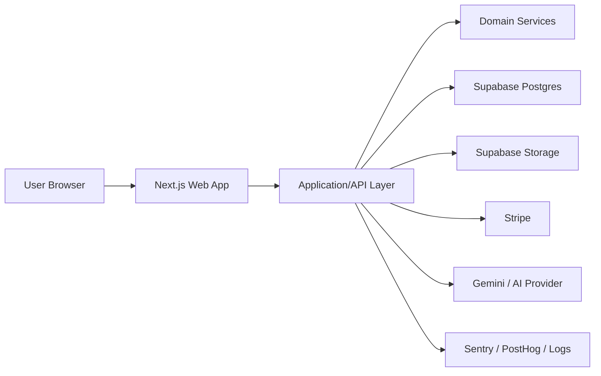
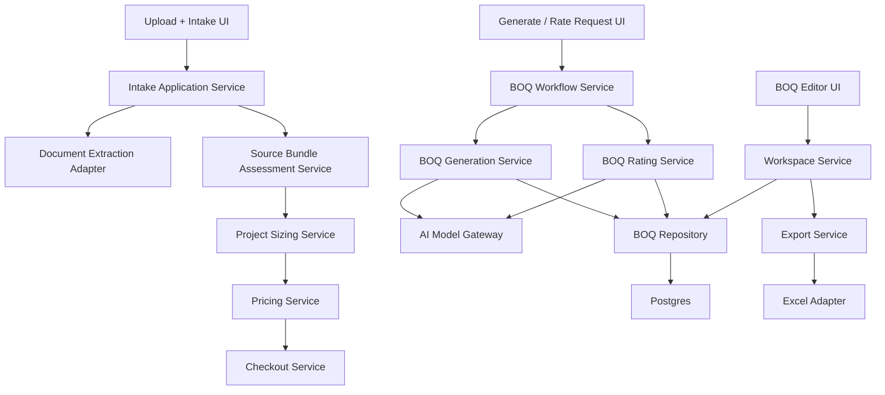
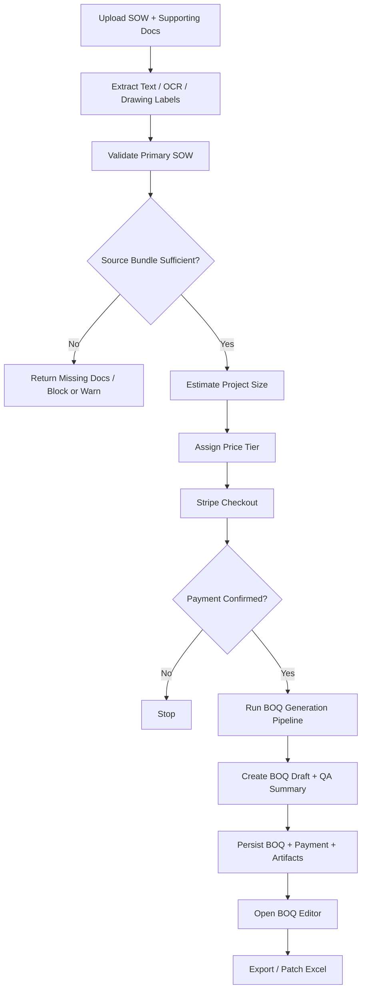
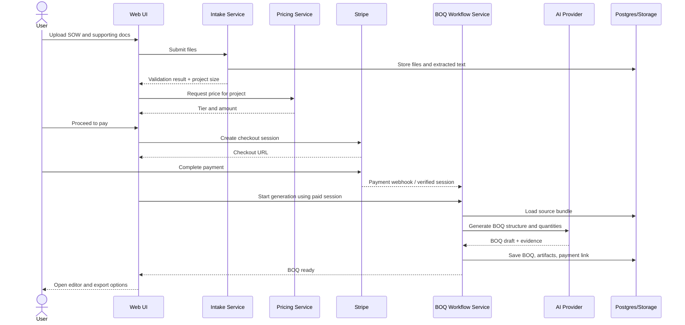
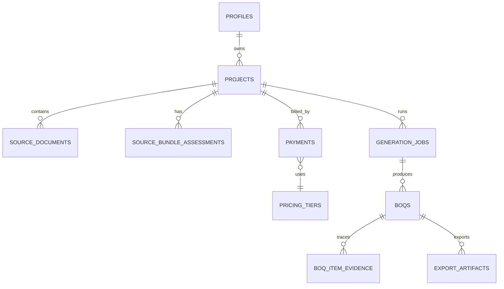

# BOQ Generator MVP Mini Technical Solution Design

## 1. Purpose

This document defines a lean technical solution design for an MVP that generates Bills of Quantities (BOQs) for the Zambian construction industry using:

- Scope of Work (SOW)
- Unpriced BOQs
- Drawings and plans
- Images and scanned supporting documents
- Other referenced documents mentioned in the SOW

The MVP should help a user upload project documents, validate whether the source bundle is sufficient, generate or rate a BOQ using AI, charge per generated output, and allow review and export.

This TSD is intentionally scoped for an MVP, not a fully automated commercial estimating platform.

## 2. Goals

- Generate a structured BOQ from a project document bundle.
- Rate an existing BOQ using Zambia-aware pricing guidance.
- Charge users before generation/rating completes.
- Keep source traceability so generated quantities and rates can be reviewed.
- Use a Domain-Driven Design approach to keep the solution modular.
- Support gradual evolution from rule-assisted AI to stronger workflow orchestration later.

## 3. Scope Summary

### In scope

- Upload and store primary and supporting project documents.
- Extract text from PDF, DOCX, drawings, and scanned files where possible.
- Classify whether the uploaded primary file is a valid construction SOW.
- Detect missing required supporting documents referenced by the SOW.
- Generate a BOQ structure from SOW plus supporting documents.
- Fill rates for BOQ items using a Zambia-specific pricing context.
- Price the service using simple project-size tiers for MVP.
- Persist BOQs, payment records, source document metadata, and processing status.
- Allow BOQ editing, QA review, and export.

### Out of scope

- Full CAD/BIM parsing.
- Fully deterministic quantity takeoff from drawings.
- Automated contract award workflows.
- Multi-currency commercial billing complexity.
- Marketplace of suppliers/subcontractors.
- Complex enterprise approval workflows.
- Offline desktop estimator tooling.
- Deep integration with ERP, procurement, or accounting systems.
- Final legal/commercial liability for estimator accuracy.

## 4. Product Assumptions

- Users are quantity surveyors, estimators, contractors, procurement teams, or project owners.
- The first market is Zambia, so document style, units, trade sections, and rate references should reflect local practice.
- BOQ generation is AI-assisted, not fully autonomous.
- Human review remains mandatory before tender submission or construction use.
- For MVP, pricing is tiered rather than dynamically calculated from every project variable.

## 5. Functional Requirements

### 5.1 User and access

- Users can sign in and view prior BOQs.
- Users can create a new BOQ generation or BOQ rating job.
- Users can reopen a previously generated BOQ and export it again.

### 5.2 Document intake

- Users can upload a primary SOW document.
- Users can upload supporting documents such as drawings, specs, schedules, images, and reference BOQs.
- The system stores file metadata, document role, and extracted text.
- The system flags unsupported, unreadable, or oversized documents.

### 5.3 Source validation

- The system validates whether the primary document is a construction SOW.
- The system identifies if the SOW references required attachments.
- The system classifies the source bundle as complete, partially complete, or missing required attachments.
- The system blocks generation when the source material is clearly insufficient.

### 5.4 BOQ generation

- The system generates BOQ bills and line items from the validated source bundle.
- The system captures quantity source type: explicit, derived, or assumed.
- The system stores evidence excerpts and source anchors where possible.
- The system generates a QA summary and flags low-confidence items.

### 5.5 BOQ rating

- Users can upload an unrated BOQ spreadsheet.
- The system extracts the BOQ structure from the spreadsheet.
- The system applies Zambia-aware rates based on context such as province, logistics, labour source, and margin assumptions.
- The system stores rate references and the reasoning basis used.

### 5.6 Pricing and payment

- Users must pay before final BOQ generation/rating completes.
- The system supports tiered pricing by project size for MVP.
- The system stores checkout session, payment amount, and payment status.
- The system supports idempotent retries for paid jobs.

### 5.7 Review and export

- Users can view generated BOQs in the browser.
- Users can edit quantities, rates, and descriptions.
- The system recalculates amounts automatically.
- Users can export a formatted BOQ Excel file.
- Users can patch rates back into an uploaded source BOQ where relevant.

### 5.8 Operations and observability

- The system logs major processing events and failures.
- The system tracks generation/rating outcomes and payment conversion.
- The system exposes health status for runtime and database availability.

## 6. Non-Functional Requirements

### 6.1 Performance

- Upload validation should respond within 5 seconds for ordinary documents.
- BOQ generation should typically complete within 2 to 5 minutes for MVP-sized jobs.
- BOQ rating should typically complete within 1 to 4 minutes for standard spreadsheets.

### 6.2 Reliability

- Payment and BOQ creation must be idempotent.
- Partial failures should not duplicate charges or duplicate BOQs.
- Users should be able to resume completed jobs after page refresh or reconnect.

### 6.3 Accuracy and quality

- The system must expose confidence and evidence, not only final values.
- The system must clearly label assumptions and low-confidence quantities.
- The system must keep auditability of source inputs used in generation/rating.

### 6.4 Security

- Documents must be private to the owning user or organization.
- Storage access must be controlled.
- Payment processing must be delegated to Stripe.
- Sensitive credentials must not be exposed to the client.

### 6.5 Scalability

- The architecture should support later movement from synchronous API execution to background jobs.
- Document extraction, AI orchestration, and export should be separable services/workers later.

### 6.6 Maintainability

- Core business concepts should be represented as domains, aggregates, and services.
- External providers such as Stripe, Gemini, and Supabase should sit behind adapters.
- AI prompts and workflows should be versioned.

### 6.7 Compliance and traceability

- The system should store enough provenance for internal review of generated outputs.
- The system should retain source references and generated artifact versions.

## 7. DDD Approach

### 7.1 Ubiquitous language

- Project: A construction job for which a BOQ is being prepared.
- Source Bundle: The set of primary and supporting documents uploaded for a project.
- SOW: The primary narrative or specification defining the work scope.
- BOQ: Structured bill containing bills, items, units, quantities, rates, and amounts.
- Generation Job: A workflow to produce a BOQ from source documents.
- Rating Job: A workflow to fill rates into an existing BOQ.
- Pricing Tier: The commercial category used to determine what the user pays.
- QA Summary: System-produced quality indicators and warnings for review.

### 7.2 Bounded contexts

#### 1. Project Intake Context

Responsibilities:

- Project creation
- Document upload
- Document classification
- Source bundle validation
- Project-size estimation

Core entities:

- Project
- SourceBundle
- SourceDocument
- IntakeAssessment

#### 2. BOQ Production Context

Responsibilities:

- BOQ structure extraction
- Quantity derivation
- Evidence tracking
- Quality scoring

Core entities:

- BOQ
- BOQBill
- BOQItem
- QuantityEvidence
- BOQArtifact

#### 3. Rate Intelligence Context

Responsibilities:

- Rate filling for existing or generated BOQ items
- Rate reference tracking
- Location and margin adjustments

Core entities:

- RateRequest
- RateContext
- RateReference
- RatedBOQ

#### 4. Commercial Context

Responsibilities:

- Pricing tier selection
- Checkout creation
- Payment confirmation
- Entitlement to generate/export

Core entities:

- PricingTier
- Order
- Payment
- AccessGrant

#### 5. User Workspace Context

Responsibilities:

- Dashboard
- BOQ editing
- Export
- History

Core entities:

- WorkspaceBOQView
- ExportArtifact

### 7.3 Aggregates

Suggested aggregates for MVP:

- `Project`
  - owns source bundle, intake status, and project classification
- `GenerationJob`
  - owns execution status for one BOQ generation attempt
- `BOQ`
  - owns bills, items, QA summary, and exportable state
- `Payment`
  - owns checkout/payment lifecycle

### 7.4 Domain services

- `SourceBundleAssessmentService`
- `ProjectSizingService`
- `BOQGenerationService`
- `BOQRatingService`
- `PricingService`
- `BOQExportService`

### 7.5 Anti-corruption layer

Adapters should isolate domain logic from vendor-specific details:

- `PaymentGateway` -> Stripe
- `AIModelGateway` -> Gemini or other LLM provider
- `DocumentStore` -> Supabase Storage
- `ProjectRepository` / `BOQRepository` / `PaymentRepository` -> Supabase Postgres

## 8. Proposed MVP Domains and Responsibilities

| Domain | Why it exists | Key outputs |
|---|---|---|
| Intake | Make sure we have valid inputs | Source bundle assessment, project size |
| Generation | Build measurable BOQ structure | BOQ draft with evidence |
| Rating | Add rates to items | Rated BOQ with pricing basis |
| Payments | Control commercial access | Paid entitlement |
| Workspace | Review and export | Editable BOQ, Excel outputs |

## 9. Project Size and Pricing Model for MVP

### 9.1 Pricing principle

For MVP, price by project size tier rather than precise computational pricing. This keeps UX simple while still aligning price to likely model cost and project complexity.

### 9.2 Suggested tiers

| Tier | Project size heuristic | Example price |
|---|---|---|
| Small | Simple scope, few documents, low item count, small building/fit-out/repair jobs | USD 100 |
| Medium | Moderate document bundle, multiple trades, mid-size building or infrastructure sections | USD 150 |
| Large | Large document bundle, many referenced drawings/specs, complex multi-trade project | USD 250 |

### 9.3 Suggested sizing inputs

Use a simple weighted heuristic:

- Number of uploaded documents
- Total extracted pages
- Whether drawings are included
- Whether multiple trades are detected
- Estimated line-item count from the first pass
- Whether the project appears to be building, industrial, civil, or mixed

### 9.4 Example sizing rule

- Small
  - up to 3 documents
  - under 25 pages total
  - likely under 80 line items
- Medium
  - 4 to 8 documents
  - 25 to 120 pages
  - 80 to 250 line items
- Large
  - over 8 documents
  - over 120 pages
  - over 250 line items

For MVP, the user can also confirm or override the detected size if confidence is low.

## 10. High-Level Technical Architecture

### 10.1 Solution style

- Web application with server-side APIs
- Modular monolith for MVP
- Domain-oriented services inside one codebase
- External managed services for auth, database, storage, AI, and payments

### 10.2 Current fit

The current repository already aligns well with this MVP shape:

- Next.js app for UI and API routes
- Supabase for auth, Postgres, storage
- Stripe for checkout
- Gemini for AI generation/rating

Recommended next step is not microservices, but stronger domain modularization inside the current codebase.

### 10.3 Logical components

- Web UI
- API layer / application services
- Domain layer
- Persistence layer
- AI orchestration layer
- File storage
- Payment integration
- Analytics/observability

## 11. C4 Model

### 11.1 C1 System Context



### 11.2 C2 Container Diagram



### 11.3 C3 Component Diagram



### 11.4 C4 Code / module sketch

Suggested module structure:

```text
src/
  modules/
    intake/
    projects/
    boq-generation/
    boq-rating/
    pricing/
    payments/
    workspace/
    exports/
  infrastructure/
    ai/
    db/
    storage/
    payments/
    observability/
  shared/
    kernel/
    types/
```

## 12. Application Flow

### 12.1 Generate BOQ from source bundle

1. User creates a project and uploads SOW plus supporting documents.
2. Intake service extracts text and metadata from each file.
3. Source bundle assessment checks:
   - is this a valid construction SOW
   - are referenced supporting documents missing
   - is the bundle good enough to proceed
4. Project sizing service estimates project size tier.
5. Pricing service returns the payable amount.
6. User pays through Stripe Checkout.
7. After payment confirmation, generation job starts.
8. BOQ generation service runs:
   - structure pass
   - quantity/evidence pass
   - QA pass
9. BOQ is saved with artifacts and provenance.
10. User lands in editor to review, adjust, and export.

### 12.2 Rate existing BOQ

1. User uploads unpriced BOQ spreadsheet.
2. System validates spreadsheet structure and expected columns.
3. User provides pricing context such as province or assumptions.
4. System sizes the job and shows price tier.
5. User pays.
6. Rating job loads spreadsheet, extracts line items, and calls rate service.
7. Rated BOQ is saved.
8. User reviews results and exports formatted or patched Excel.

## 13. Flow Diagram



## 14. Sequence Diagram



## 15. Domain Model and Data Design

### 15.1 Core entities

#### Project

- `id`
- `owner_id`
- `name`
- `project_type`
- `location`
- `country`
- `status`
- `size_tier`
- `size_score`
- `created_at`
- `updated_at`

#### SourceDocument

- `id`
- `project_id`
- `role` (`primary`, `supporting`)
- `document_kind` (`sow`, `drawing`, `spec`, `boq`, `image`, `schedule`, `other`)
- `file_name`
- `storage_key`
- `mime_type`
- `pages`
- `extracted_text`
- `extraction_status`
- `classification`
- `created_at`

#### SourceBundleAssessment

- `id`
- `project_id`
- `is_valid_sow`
- `source_bundle_status`
- `missing_required_attachments`
- `positive_signals`
- `negative_signals`
- `warnings`
- `should_block_generation`
- `assessed_at`

#### GenerationJob

- `id`
- `project_id`
- `payment_id`
- `job_type` (`generate`, `rate`)
- `status`
- `started_at`
- `completed_at`
- `failure_reason`
- `pipeline_version`

#### BOQ

- `id`
- `project_id`
- `generation_job_id`
- `title`
- `currency`
- `status`
- `data_json`
- `qa_summary_json`
- `rate_reference_json`
- `source_bundle_snapshot_json`
- `created_at`
- `updated_at`

#### BOQItemEvidence

- `id`
- `boq_id`
- `item_key`
- `source_document_id`
- `source_excerpt`
- `source_anchor`
- `evidence_type`
- `confidence`
- `derivation_note`

#### PricingTier

- `id`
- `code`
- `name`
- `currency`
- `amount_cents`
- `rules_json`
- `active`

#### Payment

- `id`
- `project_id`
- `user_id`
- `pricing_tier_id`
- `stripe_session_id`
- `stripe_payment_intent`
- `amount_cents`
- `currency`
- `status`
- `created_at`

#### ExportArtifact

- `id`
- `boq_id`
- `type` (`formatted_excel`, `patched_excel`)
- `storage_key`
- `created_at`

### 15.2 Suggested database design

For MVP, keep `boqs.data` JSONB for flexibility, but introduce stronger relational boundaries around project, documents, jobs, and pricing.

Suggested relational tables:

- `profiles`
- `projects`
- `source_documents`
- `source_bundle_assessments`
- `pricing_tiers`
- `payments`
- `generation_jobs`
- `boqs`
- `boq_item_evidence`
- `export_artifacts`

### 15.3 ER sketch



## 16. Recommended Schema Evolution from Current Repo

The current repo already has:

- `profiles`
- `boqs`
- `payments`
- storage linkage for uploaded Excel

Recommended next schema additions:

1. Add `projects`
   - make project the top-level business aggregate instead of using BOQ as the first-class root
2. Add `source_documents`
   - store all uploaded source files, not only the rated Excel source key
3. Add `generation_jobs`
   - separate workflow status from BOQ record
4. Add `pricing_tiers`
   - support configurable tier pricing
5. Add richer payment linkage
   - tie payment to project and job, not only final BOQ

## 17. Integration Design

### 17.1 AI orchestration

The AI orchestration should remain multi-step, not one giant prompt:

1. Source validation and classification
2. BOQ structure extraction
3. Quantity extraction / derivation
4. Rate filling
5. QA scoring and consistency checks

Benefits:

- Better retry behavior
- Better explainability
- Easier prompt tuning
- Easier model substitution later

### 17.2 Document extraction

Document extraction should support:

- text PDFs
- scanned PDFs via OCR/vision
- DOCX
- spreadsheets
- images for plan labels and visible notes

For MVP, extracted text remains the main normalization layer.

### 17.3 Payments

- Checkout session created after size estimation
- Metadata should include project ID, job type, pricing tier, and document bundle hash if useful
- Webhook confirms paid state
- Generation job checks payment status before execution

## 18. Security and Access Model

- Every project belongs to a user.
- Every source document belongs to a project.
- Every BOQ belongs to a project.
- Row-level security should be enforced in Supabase.
- Private storage buckets should be used for source docs and exports.
- Service-role operations should be limited to server-side routes/workers only.

## 19. Error Handling Strategy

Classes of failure:

- Invalid document
- Missing required supporting files
- Payment not completed
- AI provider timeout/rate limit
- Output quality too weak for release
- Export generation failure

User experience expectations:

- Fail early on invalid inputs
- Warn or block on insufficient source bundle
- Allow safe retries for paid jobs
- Surface actionable review messages, not only technical errors

## 20. Observability

Track at minimum:

- upload started/completed
- document classified
- source bundle blocked/warned/passed
- price tier assigned
- checkout started/completed
- generation started/completed/failed
- rating started/completed/failed
- export started/completed/failed

Operational dashboards should focus on:

- conversion by tier
- average generation time
- AI failure rates
- document insufficiency rates
- average BOQ size by project type

## 21. Risks and Mitigations

| Risk | Impact | Mitigation |
|---|---|---|
| Poor source document quality | Weak BOQ accuracy | Source bundle validation, missing-doc warnings, confidence scoring |
| Drawing-heavy jobs overwhelm text extraction | Missing quantities | Treat drawings as supporting evidence, not sole quantity source for MVP |
| AI hallucinated items or rates | Commercial risk | Evidence traces, QA flags, human review required |
| Payment success but workflow failure | User frustration | Idempotent job restart, save job status, support retry after payment |
| Large projects exceed sync runtime | Reliability issues | Move long jobs to async background workers in next phase |

## 22. Recommended MVP Delivery Phases

### Phase 1

- Project + source document model
- Source bundle validation
- Tiered pricing
- Paid generation/rating
- BOQ editor and export

### Phase 2

- Async job execution
- Better project sizing heuristics
- Organization/team support
- Stronger rate libraries and benchmarking

### Phase 3

- Semi-automated drawing takeoff
- Review workflow and approvals
- Portfolio analytics

## 23. Key Design Decisions

- Use modular monolith, not microservices, for MVP.
- Use DDD bounded contexts to keep business logic clear.
- Keep BOQ payload flexible in JSONB while modeling project, document, job, and payment relationally.
- Use tier pricing for MVP instead of full dynamic pricing.
- Treat AI output as reviewable draft, not final commercial truth.

## 24. Open Questions

- Should pricing be shown in USD only, or also in ZMW for local users?
- Should project size be auto-detected only, or user-confirmed before checkout?
- Should supporting documents be mandatory for certain project classes such as schools, industrial, or civil works?
- Do we want one payment per final BOQ only, or separate charges for regeneration/re-rating?
- What minimum evidence threshold should block release of a generated BOQ?

## 25. Recommended Next Step

Convert this mini TSD into:

1. Product requirements and acceptance criteria
2. Domain model and schema migration plan
3. API contract definitions
4. Prompt/workflow specs for intake, generation, rating, and QA
5. Delivery backlog for the MVP
